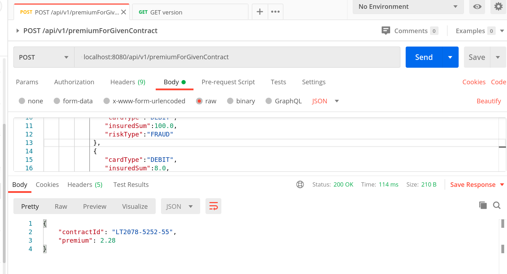
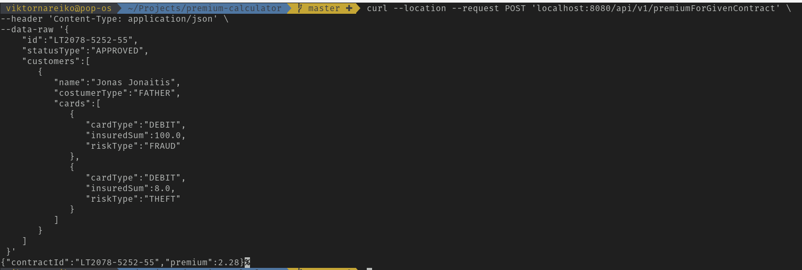

# Premium calculator
Calculates premium according contract details. You can access precompiled and deployed version of [application](https://learncurve-dev.ey.r.appspot.com/).

# Getting started

Clone the project

```
git clone git@github.com:viktornar/premium-calculator.git
```

Go to project directory and run

```
./gradlew bootRun
```

If you are using Windows please use cmd

```
gradlew.bat bootRun
```

Before running spring boot make sure that port 8080 is not used and is open.

You can also import project into IntelliJ or other IDE by using import and then run main class.

For testing purpose you can use Postman:




In project root directory look at postman folder. In this folder I have added postman collection that can be imported.

If you are familiar with CURL you can use such command:

```
curl --location --request POST 'localhost:8080/api/v1/premiumForGivenContract' \
--header 'Content-Type: application/json' \
--data-raw '{
    "id":"LT2078-5252-55",
    "statusType":"APPROVED",
    "customers":[
       {
          "name":"Jonas Jonaitis",
          "customerType":"FATHER",
          "cards":[
             {
                "cardType":"DEBIT",
                "insuredSum":100.0,
                "riskType":"FRAUD"
             },
             {
                "cardType":"DEBIT",
                "insuredSum":8.0,
                "riskType":"THEFT"
             }
          ]
       }
    ]
 }'
```



The source code have compatibility with version 1.8 of java. I have used java 11 but everything should run on java 1.8 as well.

Be aware that I have used lombok so you need to enable annotation preprocessor and also install lombok plugin in your IDE. The reason why I decided to use lombok - the less code and the less boilerplate the better code maintainability.

If you are lazy and do not want to build application you can use [demo](https://learncurve-dev.ey.r.appspot.com/) of application that deployed to GAE.

Rest API do some simple validation. Validation error is exposed by using ControllerAdvice. Error messages support localixartion e.g.:

```
curl --location -H "Accept-Language: lt" --request POST 'localhost:8080/api/v1/premiumForGivenContract' \
--header 'Content-Type: application/json' \
--data-raw '{
    "id":"LT2078-5252-55",
    "statusType":"APPROVED",
    "customers":[
       {
          "name":"Jonas Jonaitis",
          "customerType":"FATHER"
       }
    ]
 }'
```

# Structure

I tried to follow LIFT project structure (so it should be easy to navigate):

1. **L**ocating our code is easy
2. **I**dentify code at a glance
3. **F**lat structure as long as we can
4. **T**ry to stay DRY (Don't Repeat Yourself) or T-DRY
```
.
└── com
    └── github
        └── viktornar
            ├── PremiumCalculatorApplication.java
            ├── controllers
            │   ├── IndexRestController.java
            │   └── PremiumCalculatorRestController.java
            ├── models
            │   ├── BaseModel.java
            │   ├── CardModel.java
            │   ├── ContractModel.java
            │   └── CustomerModel.java
            ├── premium
            │   ├── Constants.java
            │   ├── Premium.java
            │   ├── aggregator
            │   │   └── Aggregator.java
            │   └── calculator
            │       ├── Calculator.java
            │       ├── CalculatorFactory.java
            │       ├── FraudCalculator.java
            │       ├── GenericCalculator.java
            │       ├── NotFoundCalculatorException.java
            │       └── TheftCalculator.java
            ├── services
            │   ├── AggregatorService.java
            │   ├── ContractPremiumService.java
            │   ├── NoCardException.java
            │   └── NoCustomerException.java
            ├── types
            │   ├── CardType.java
            │   ├── CustomerType.java
            │   ├── RiskType.java
            │   └── StatusType.java
            └── utils
                └── MathUtil.java
```

# What can be done better

* I have decided to use strategy and factory patterns so it would be easier to extend premium calculation logic. Probably the person who knows design patterns better could found the better way to implement that.

* I have used some inheritance at model level and not sure if it is needed. It just a habit that come from hibernate.

* Need to write more tests. Basically, I wrote tests that covers success scenarios, but didn't write test cases for failure scenarios :(

* Not sure if I'm handling errors in correct way. Basically, I'm using checked exceptions so it is ok to pass them up to controller and display in response if customer is not specified in contract.

* I like to use enum for separating types of provided components. Some developers do not like to use enum in such case.